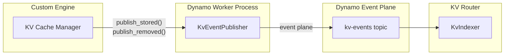
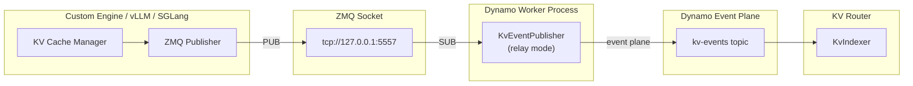

# KV Event Publishing for Custom Engines

This document explains how to implement KV event publishing for custom inference engines, enabling them to participate in Dynamo's KV cache-aware routing.

## Overview

The KV Router relies on real-time events from backend workers to track which KV cache blocks are stored on each worker. When your custom engine allocates or evicts KV cache blocks, it should publish these events so the router can make optimal routing decisions.

Events are published over the **Dynamo event plane**, a transport-agnostic pub/sub layer that supports both NATS and ZMQ backends (see [Event Plane](../design-docs/event-plane.md) for details). The `KvEventPublisher` binding handles all transport concerns — your engine code does not interact with the event plane directly.

`KvEventPublisher` supports two publishing modes:

1. **Direct publishing** — Your engine calls `publish_stored()` / `publish_removed()` to push events directly over the event plane. Simplest approach for custom engines.
2. **ZMQ relay** — For engines that emit raw KV events over a ZMQ socket (like vLLM and SGLang). The publisher subscribes to the ZMQ endpoint and relays events to the event plane automatically.

## Event Types

The KV cache supports three event types:

| Event Type | Description | When to Publish |
|------------|-------------|-----------------|
| `BlockStored` | New blocks added to cache | After KV cache allocation succeeds |
| `BlockRemoved` | Blocks evicted from cache | When blocks are evicted or freed |
| `AllBlocksCleared` | All blocks removed | On cache reset or worker restart |

### Event Structure

Each event contains:
- **`event_id`**: Monotonically increasing identifier per worker (managed internally by the publisher)
- **`dp_rank`**: Data parallel rank (0 if DP not enabled)
- **`data`**: One of `Stored`, `Removed`, or `Cleared`

For `BlockStored` events:
- **`token_ids`**: List of token IDs for the stored blocks
- **`block_hashes`**: List of **sequence block hashes** from the engine's block manager. These are cumulative hashes that incorporate all tokens from the start of the sequence up to and including the current block (not just the tokens within that block). This enables prefix matching across requests.
- **`num_block_tokens`**: Number of tokens per block (should all equal `kv_block_size`)
- **`parent_hash`**: Hash of the parent block. Required for all blocks except the first block in a sequence (which has no parent).
- **`lora_id`**: LoRA adapter ID (0 if not using LoRA)

For `BlockRemoved` events:
- **`block_hashes`**: List of sequence block hashes being evicted

## Direct Publishing (Recommended for Custom Engines)

Call `publish_stored()` and `publish_removed()` directly from your engine code. The publisher handles event IDs, serialization, and transport.



**When to use:**
- Building a custom inference engine from scratch
- Your engine doesn't have a ZMQ-based event system
- You want the simplest integration path

### Basic Setup

```python
from dynamo.llm import KvEventPublisher

class CustomEnginePublisher:
    def __init__(self, component, block_size: int, dp_rank: int = 0):
        self.block_size = block_size
        self.kv_publisher = KvEventPublisher(
            component=component,
            kv_block_size=block_size,
            dp_rank=dp_rank,
        )

    def on_blocks_stored(self, token_ids: list[int], block_hashes: list[int],
                         lora_id: int = 0, parent_hash: int | None = None):
        """Call after KV cache blocks are allocated."""
        num_block_tokens = [self.block_size] * len(block_hashes)
        self.kv_publisher.publish_stored(
            token_ids=token_ids,
            num_block_tokens=num_block_tokens,
            block_hashes=block_hashes,
            lora_id=lora_id,
            parent_hash=parent_hash,
        )

    def on_blocks_removed(self, block_hashes: list[int]):
        """Call when KV cache blocks are evicted."""
        self.kv_publisher.publish_removed(block_hashes=block_hashes)
```

### Integration with Your Engine

```python
from dynamo.llm import register_model

async def main():
    component, endpoint = await register_model(
        model="my-model",
        generator=my_generate_fn,
    )

    publisher = CustomEnginePublisher(
        component=component,
        block_size=16,  # Match your engine's block size
    )

    def on_prefill_complete(request_id, token_ids, blocks):
        block_hashes = [block.hash for block in blocks]
        publisher.on_blocks_stored(token_ids=token_ids, block_hashes=block_hashes)

    def on_cache_eviction(evicted_blocks):
        block_hashes = [block.hash for block in evicted_blocks]
        publisher.on_blocks_removed(block_hashes=block_hashes)
```

## ZMQ Relay (For Engines with Raw KV Events)

For engines that already publish raw KV events over a ZMQ socket (like vLLM and SGLang), use the same `KvEventPublisher` with a `zmq_endpoint`. The publisher subscribes to the ZMQ socket and relays events to the event plane automatically.



**When to use:**
- Your engine already publishes KV events via ZMQ (like vLLM or SGLang)
- You want to decouple event publishing from your engine's main loop

### Setup

Pass `zmq_endpoint` (and optional `zmq_topic`) to the same `KvEventPublisher`:

```python
from dynamo.llm import KvEventPublisher

kv_publisher = KvEventPublisher(
    component=component,
    kv_block_size=block_size,
    zmq_endpoint="tcp://127.0.0.1:5557",  # Where your engine publishes
    zmq_topic="",                          # Subscribe to all topics
)
```

No further calls to `publish_stored()` / `publish_removed()` are needed — the publisher reads events from the ZMQ socket and forwards them automatically.

### ZMQ Wire Format

The ZMQ message format (compatible with vLLM / SGLang):

| Frame | Description |
|-------|-------------|
| 1 | Topic (empty string for all topics) |
| 2 | Sequence number (8 bytes, big-endian) |
| 3 | Msgpack payload: `[timestamp, [events], dp_rank]` |

Each event in the payload is a dictionary with a `type` field (`BlockStored`, `BlockRemoved`, or `AllBlocksCleared`).

For `BlockStored`:
```python
{
    "type": "BlockStored",
    "block_hashes": [signed_i64, ...],      # Sequence block hashes
    "parent_block_hash": signed_i64 | None,  # Parent hash
    "token_ids": [int, ...],                 # Token IDs
    "block_size": int,                       # Tokens per block
    "lora_id": int | None,                   # LoRA adapter ID
}
```

For `BlockRemoved`:
```python
{
    "type": "BlockRemoved",
    "block_hashes": [signed_i64, ...],
}
```

For `AllBlocksCleared`:
```python
{"type": "AllBlocksCleared"}
```

## API Reference

### `KvEventPublisher`

```python
KvEventPublisher(
    component: Component,
    kv_block_size: int,
    dp_rank: int = 0,
    enable_local_indexer: bool = False,
    zmq_endpoint: str | None = None,   # Set for relay mode
    zmq_topic: str | None = None,      # Defaults to "" when zmq_endpoint is set
)
```

| Parameter | Description |
|-----------|-------------|
| `component` | The Dynamo component this publisher belongs to |
| `kv_block_size` | Number of tokens per block (must be > 0, must match your engine) |
| `dp_rank` | Data parallel rank (defaults to 0) |
| `enable_local_indexer` | Enable a worker-local KV indexer for direct overlap queries |
| `zmq_endpoint` | ZMQ endpoint to subscribe to for relay mode (e.g. `"tcp://127.0.0.1:5557"`) |
| `zmq_topic` | ZMQ topic filter (defaults to `""` = all topics) |

#### `publish_stored()`

```python
publish_stored(
    token_ids: list[int],
    num_block_tokens: list[int],
    block_hashes: list[int],
    lora_id: int,
    parent_hash: int | None = None,
)
```

Publish a block-stored event. Event IDs are managed internally.

#### `publish_removed()`

```python
publish_removed(block_hashes: list[int])
```

Publish a block-removed event. Event IDs are managed internally.

#### `shutdown()`

```python
shutdown()
```

Stop background tasks (ZMQ listener, event forwarding).

## Best Practices

1. **`kv_block_size` must match** your engine's actual block size.

2. **`parent_hash` is required** for all blocks except the first in a sequence — it links blocks to enable prefix matching.

3. **Block hashes are signed 64-bit integers** in the Python API. The publisher handles conversion internally.

4. **Event ordering is automatic** — the publisher assigns monotonically increasing event IDs. You do not need to track event IDs yourself.

## See Also

- **[Event Plane](../design-docs/event-plane.md)**: Transport options (NATS, ZMQ) and configuration
- **[Router Guide](../components/router/router-guide.md)**: Configuration, tuning, and production setup
- **[Router Design](../design-docs/router-design.md)**: Architecture details and event transport modes
